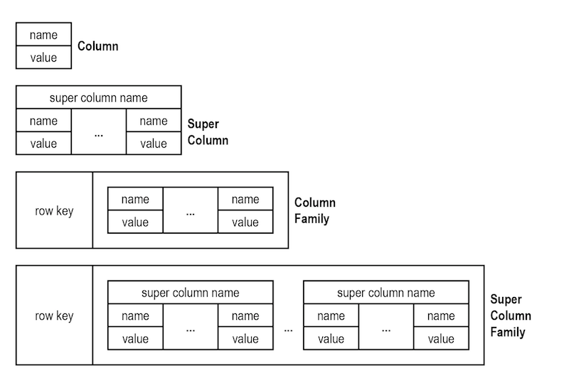

# NoSQL, a introduction

- [NoSQL, a introduction](#nosql-a-introduction)
	- [What is a NoSQL database?](#what-is-a-nosql-database)
	- [Types of NoSQL databases](#types-of-nosql-databases)
	- [Practical example](#practical-example)
		- [In **RDBMS**:](#in-rdbms)
		- [As a document database:](#as-a-document-database)
			- [Mapping concepts:](#mapping-concepts)
		- [As a Key-value database](#as-a-key-value-database)
			- [Mapping concepts:](#mapping-concepts-1)
		- [Wide-column database](#wide-column-database)
			- [Mapping concepts:](#mapping-concepts-2)
		- [Graph databases](#graph-databases)
			- [Mapping concepts:](#mapping-concepts-3)
	- [Conclusion](#conclusion)

<br/>

## What is a NoSQL database?

NoSQL databases are databases that store data in a format other than relational tables. This means that there is more flexibility when storing data and quickly retrieving it.

Some features are common in many NoSQL databases, for example:

- Flexible schemas
- Horizontal scaling
- Fast queries due to the data model
- Ease of use for developers

<br/>

## Types of NoSQL databases

There is four major types of NoSQL databases:

- ***Document databases***: Store data in structures similar to **JSON** objects. Each document contains a pair of fields and values. And the values can be from a variety of types (strings, numbers, booleans, arrays or objects).
- ***Key-value databases***: This is a simpler type of database, where the data is stored in items containing **keys and values**.This database is like an relational database with two columns: the attribute name (such as "theme") and the value (such as "light").
- ***Wide-column databases***: Store data in tables, rows and dynamic columns, the difference between relational database and the wide-columns database is that, **a column is only written if there’s a data element for it**. Witch means, each row might have different columns depending on the data stored.
- ***Graph databases***: Focus on relationship between data elements. Where **nodes store information and edges stores the relationship** between the nodes.

<br/>

## Practical example

Let's model some data to clear up the concept of NoSQL and relational database management system (**RDBMS**). We will see one example, and apply it to each of the 4 major types.

Imagine if we wanted to store information about a user, their hobbies and their job history.

### In **RDBMS**:

**Users**:

| ID  | first_name | last_name | cell           | city     |
| --- | ---------- | --------- | -------------- | -------- |
| 1   | Camila     | Gomes     | (99) 999999999 | Campinas |

**Hobbies**:

| ID  | user_id | hobby              |
| --- | ------- | ------------------ |
| 1   | 1       | Reading            |
| 2   | 1       | Listening to music |
| 3   | 1       | Programming        |

**JobHistory**:

| ID  | user_id | job_title     | year_started |
| --- | ------- | ------------- | ------------ |
| 1   | 1       | Web developer | 2023         |

In this case, to retrieve the information about the user, their hobbies and their job history, we would have to join the data from users and hobbies.

### As a document database:

```json
{
	"_id": 1,
	"first_name": "Camila",
	"last_name": "Gomes",
	"cell": "(99) 999999999",
	"city": "Campinas",
	"hobbies": ["Reading", "Listening to music", "Programming"],
	"jobHistory": [
		{
			"title": "Web developer",
			"yearStarted": 2023
		}
	]
}
```
<br/>

> ATTENTION: If, for example, one user does not provide a cellphone number, the best practice is to not even include the "cell" in our document.

<br/>

As a result of storing all the information in a single document, we can retrieve it all without having to make joins. Witch leads to faster queries.


#### Mapping concepts:

- Column  &rarr; Field
  
  

- Row &rarr; Document
  


- Table &rarr; Collection
  


### As a Key-value database

```json
Key: 1
Value: {
	"first_name": "Camila",
	"last_name": "Gomes",
	"cell": "(99) 999999999",
	"city": "Campinas",
	"hobbies": ["Reading", "Listening to music", "Programming"],
	"jobHistory": [
		{
			"title": "Web developer",
			"yearStarted": 2023
		}
	]
}
```

The key-value pair is a way to store data with a key, being an identifier feature of the data, and the value, being the data to be stored under the key.

This way we can have high performance and scalability thanks to their simplicity.

#### Mapping concepts:

- **Key**: It is an identifier of the data, could be an Id, or some other data that identify the value as unique.
- **Value**: It is the data to be put under the Key. Usually a Json storing al the data of the key.


### Wide-column database

It could be done in the multiple ways, in the **entity**/**attribute**/**value** way:

| ID  | Attribute    | Value                |
| --- | ------------ | -------------------- |
| 1   | first_name   | 'Camila'             |
| 1   | last_name    | 'Gomes'              |
| 1   | cell         | '(99) 999999999'     |
| 1   | city         | 'Campinas'           |
| 1   | hobby1       | "Reading"            |
| 1   | hobby2       | "Listening to music" |
| 1   | hobby3       | "Programming"        |
| 1   | job_title    | "Web developer"      |
| 1   | year_started | 2023                 |

In the **Super columns** way:

| ID           | 1                    |
| ------------ | -------------------- |
| Attribute    | Value                |
| ------------ | -------------------- |
| first_name   | 'Camila'             |
| last_name    | 'Gomes'              |
| cell         | '(99) 999999999'     |
| city         | 'Campinas'           |
| hobby1       | "Reading"            |
| hobby2       | "Listening to music" |
| hobby3       | "Programming"        |
| job_title    | "Web developer"      |
| year_started | 2023                 |


In the **Column family** way:

| Id  | Value      |           |                  |           |                      |               |                 |              |
| --- | ---------- | --------- | ---------------- | --------- | -------------------- | ------------- | --------------- | ------------ |
| 1   | first_name | last_name | cell             | hobby1    | hobby2               | hobby3        | job_title       | year_started |
|     | 'Camila'   | 'Gomes'   | '(99) 999999999' | "Reading" | "Listening to music" | "Programming" | "Web developer" | 2023         |


In the **Super Column family** way:

| Id  | Value      |                  |        |                      |         |     |
| --- | ---------- | ---------------- | ------ | -------------------- | ------- | --- |
| 1   | MyInfo     |                  | Hobby  |                      | JobInfo |     |
|     | first_name | 'Camila'         | hobby1 | "Reading"            | job_title | "Web developer" |
|     | last_name  | 'Gomes'          | hobby2 | "Listening to music" |  year_started | 2023            | 
|     | cell       | '(99) 999999999' | hobby3 | "Programming"        |         |     |


This type of database is column oriented. What does it mean? It means that instead of storing the related data in rows, we store in columns. We can have more than one column to describe a dataset, also, depending on the amount of data we can add a row to it and have all the related data inside a row, even if the amount of columns defer from each row.


#### Mapping concepts:

- Types of storage
  
  

- Difference between the row-oriented database and column oriented database

 

- A example of the Column Families

 

- A example of the Super Column Families

 


### Graph databases

 

The Graph database is focused on the relation between the entities. In each database there will be: 

- **Nodes**: they are labels that represents roles in a domain, for example people.
- **Relationships**: the connection between two node entities. They always will have an direction, they will have an start node and an end node. An example would be "**LIKES**", a Person **LIKES** Hobbies.


#### Mapping concepts:

- Another example:
  
 

- Example of nodes and relationships:
  
 


## Conclusion

We have seen all the major types of NoSQL databases, with some practical examples. But to synthesize all we have seen in this article:

- There are 4 major types of NoSQL databases:

  - ***Document databases***: Uses JSON to store data, with pair of fields and values.

  - ***Key-value databases***: Store data with keys (unique values that makes reference to the data), and values (the data of the key)

  - ***Wide-column databases***: Is a column oriented database, in witch can be stored data in four different ways. And each rows might have different number of columns depending on the data stored.

  - ***Graph databases***: Focus on relationship between data elements. Where **nodes store information and edges stores the relationship** between the nodes.

Thank you for reading until here, I hope you liked! **If there is any questions, contact me!**

***See you around!!!***
